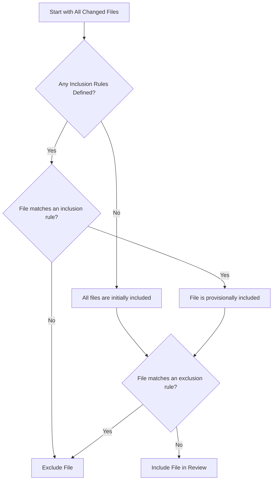

# Configuring File Scope

To ensure the AI's resources are focused on relevant source code, AIGNE CodeSmith provides a robust path filtering mechanism. By configuring `path_filters`, you can precisely control which files are included in or excluded from the code review and summarization process. This helps in avoiding reviews of generated files, dependencies, or other non-essential assets, leading to faster and more relevant feedback.

This guide details the filter logic, syntax, and provides practical examples for effective configuration.

## How Path Filters Work

The file filtering logic is governed by a set of rules defined in the `path_filters` input. These rules determine the final set of files that the AI will analyze. The process follows a clear sequence, which is essential to understand for correct configuration.

The filtering mechanism operates based on the following principles:
1.  **Default Inclusion**: If no filters are specified, all changed files are included in the review.
2.  **Inclusion Rules**: If any inclusion patterns (e.g., `src/**`) are defined, a file *must* match at least one of these patterns to be considered for review.
3.  **Exclusion Rules**: If a file matches an exclusion pattern (e.g., `!dist/**`), it is definitively excluded from the review, even if it also matches an inclusion pattern.

This flow ensures that exclusion rules always have the final say, allowing you to carve out exceptions from a broadly included set of files.



## Configuration

You can configure path filters directly in your GitHub workflow file using the `path_filters` input. Each line in the input string is treated as a separate filter pattern.

Patterns are processed using `minimatch`, which supports standard glob expressions similar to those used in `.gitignore` files.

<x-field-group>
  <x-field data-name="path_filters" data-type="string">
    <x-field-desc markdown>
      A multi-line string where each line is a glob pattern.
      - Patterns starting with `!` are exclusion patterns.
      - All other patterns are inclusion patterns.
    </x-field-desc>
  </x-field>
</x-field-group>

```yaml action.yml icon=mdi:cog
name: AIGNE CodeSmith Review
on:
  pull_request:
    types: [opened, synchronize, reopened]
jobs:
  code-review:
    runs-on: ubuntu-latest
    steps:
      - name: AIGNE CodeSmith Action
        uses: aigne-labs/codesmith-action@v1
        with:
          anthropic_api_key: ${{ secrets.ANTHROPIC_API_KEY }}
          path_filters: |
            # Include all files in the src directory
            src/**
            # Exclude test files from the review
            !**/*.test.js
            !**/*.spec.ts
            # Exclude generated protobuf files
            !**/*.pb.go
```

### Pattern Syntax

The filter patterns use glob syntax to match file paths. Here are some common examples:

| Pattern | Description |
| :--- | :--- |
| `src/**` | Matches all files and directories within the `src` directory. |
| `!dist/**` | Excludes the entire `dist` directory and its contents. |
| `!**/*.md` | Excludes all files with the `.md` extension. |
| `!**/vendor/**` | Excludes all `vendor` directories, regardless of their location. |
| `!**/*.min.js`| Excludes all minified JavaScript files. |

For a comprehensive guide on the pattern syntax, refer to the official [`minimatch` documentation](https://github.com/isaacs/minimatch).

## Default Filters

AIGNE CodeSmith comes with a comprehensive set of default exclusion filters. These are designed to ignore common non-source code files such as binaries, compressed files, logs, dependency lock files, and build artifacts. This default configuration helps to immediately focus the AI on what matters most—your source code.

<details>
<summary>View the default exclusion list</summary>

```
!dist/**
!**/*.app
!**/*.bin
!**/*.bz2
!**/*.class
!**/*.db
!**/*.csv
!**/*.tsv
!**/*.dat
!**/*.dll
!**/*.dylib
!**/*.egg
!**/.env*
!**/*.glif
!**/*.gz
!**/*.xz
!**/*.zip
!**/*.7z
!**/*.rar
!**/*.zst
!**/*.ico
!**/*.jar
!**/*.tar
!**/*.war
!**/*.lo
!**/*.log
!**/*.md
!**/*.mp3
!**/*.wav
!**/*.wma
!**/*.mp4
!**/*.avi
!**/*.mkv
!**/*.wmv
!**/*.m4a
!**/*.m4v
!**/*.3gp
!**/*.3g2
!**/*.rm
!**/*.mov
!**/*.flv
!**/*.iso
!**/*.swf
!**/*.flac
!**/*.nar
!**/*.o
!**/*.ogg
!**/*.otf
!**/*.p
!**/*.pdf
!**/*.doc
!**/*.docx
!**/*.xls
!**/*.xlsx
!**/*.ppt
!**/*.pptx
!**/*.pkl
!**/*.pickle
!**/*.pyc
!**/*.pyd
!**/*.pyo
!**/*.pub
!**/*.pem
!**/*.rkt
!**/*.so
!**/*.ss
!**/*.eot
!**/*.exe
!**/*.pb.go
!**/*.lock
!**/*.ttf
!**/*.yaml
!**/*.yml
!**/*.cfg
!**/*.toml
!**/*.ini
!**/*.mod
!**/*.sum
!**/*.work
!**/*.json
!**/*.mmd
!**/*.svg
!**/*.jpeg
!**/*.jpg
!**/*.png
!**/*.gif
!**/*.bmp
!**/*.tiff
!**/*.webm
!**/*.woff
!**/*.woff2
!**/*.dot
!**/*.md5sum
!**/*.wasm
!**/*.snap
!**/*.parquet
!**/gen/**
!**/_gen/**
!**/generated/**
!**/@generated/**
!**/vendor/**
!**/*.min.js
!**/*.min.js.map
!**/*.min.js.css
!**/*.tfstate
!**/*.tfstate.backup
!**/package.json
!**/package-lock.json
!**/yarn.lock
!**/pnpm-lock.yaml
```

</details>

When you provide your own `path_filters`, you override these defaults. If you wish to keep the defaults and add your own rules, you must copy the default list into your workflow file and append your custom rules.

## Practical Examples

### Example 1: Only Review Code in the `app` Directory

If your repository contains multiple projects but you only want to review changes within the `app` directory, you can define a specific inclusion rule.

```yaml action.yml icon=mdi:cog
with:
  anthropic_api_key: ${{ secrets.ANTHROPIC_API_KEY }}
  path_filters: |
    app/**
    !**/*.log
```

In this case, only files inside the `app` directory will be reviewed. Any `.log` files within `app` will still be excluded.

### Example 2: Exclude Documentation and Configuration Files

To prevent the AI from reviewing changes to Markdown files and YAML configurations while retaining the default filters, you would append new rules.

```yaml action.yml icon=mdi:cog
with:
  anthropic_api_key: ${{ secrets.ANTHROPIC_API_KEY }}
  path_filters: |
    # Start with the default list (shortened for brevity)
    !dist/**
    !**/*.log
    !**/*.lock
    !**/vendor/**
    # ... (include all other default rules) ...

    # Add custom rules
    !**/*.md
    !**/*.yml
    !**/*.yaml
```

### Example 3: Review a Specific Module but Exclude its Test Data

Imagine you want to review a Python module located in `src/processing` but exclude the `src/processing/testdata` directory.

```yaml action.yml icon=mdi:cog
with:
  anthropic_api_key: ${{ secrets.ANTHROPIC_API_KEY }}
  path_filters: |
    src/processing/**
    !src/processing/testdata/**
```

This configuration first includes everything under `src/processing` and then specifically excludes the `testdata` subdirectory.

By mastering path filters, you can create a highly efficient code review workflow that directs the AI's analytical capabilities precisely where you need them most. For a complete list of all configuration options, see the [Configuration Options](./reference-configuration-options.md) reference.