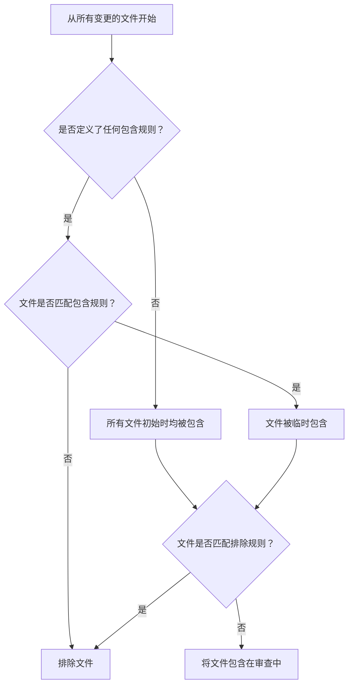

# 配置文​​件作用域

为了确保 AI 的资源集中在相关的源代码上，AIGNE CodeSmith 提供了一个强大的路径过滤机制。通过配置 `path_filters`，您可以精确控制哪些文件被包含在代码审查和摘要流程中，或从中排除。这有助于避免审查生成的文件、依赖项或其他非核心资产，从而获得更快、更相关的反馈。

本指南详细介绍了过滤逻辑、语法，并提供了有效配置的实用示例。

## 路径过滤器的工作原理

文件过滤逻辑由 `path_filters` 输入中定义的一组规则控制。这些规则决定了 AI 将分析的最终文件集。该过程遵循一个清晰的顺序，理解这一点对于正确配置至关重要。

过滤机制基于以下原则运行：
1.  **默认包含**：如果未指定过滤器，所有变更的文件都将包含在审查中。
2.  **包含规则**：如果定义了任何包含模式（例如 `src/**`），文件*必须*至少匹配其中一个模式才能被考虑进行审查。
3.  **排除规则**：如果文件匹配排除模式（例如 `!dist/**`），即使它同时也匹配包含模式，也必定会从审查中排除。

此流程确保排除规则始终拥有最终决定权，允许您从广泛包含的文件集中排除例外。



## 配置

您可以直接在您的 GitHub 工作流文件中使用 `path_filters` 输入来配置路径过滤器。输入字符串中的每一行都被视为一个独立的过滤模式。

模式使用 `minimatch` 进行处理，它支持类似于 `.gitignore` 文件中使用的标准 glob 表达式。

<x-field-group>
  <x-field data-name="path_filters" data-type="string">
    <x-field-desc markdown>
      一个多行字符串，每行是一个 glob 模式。
      - 以 `!` 开头的模式是排除模式。
      - 所有其他模式都是包含模式。
    </x-field-desc>
  </x-field>
</x-field-group>

```yaml action.yml icon=mdi:cog
name: AIGNE CodeSmith Review
on:
  pull_request:
    types: [opened, synchronize, reopened]
jobs:
  code-review:
    runs-on: ubuntu-latest
    steps:
      - name: AIGNE CodeSmith Action
        uses: aigne-labs/codesmith-action@v1
        with:
          anthropic_api_key: ${{ secrets.ANTHROPIC_API_KEY }}
          path_filters: |
            # 包含 src 目录中的所有文件
            src/**
            # 从审查中排除测试文件
            !**/*.test.js
            !**/*.spec.ts
            # 排除生成的 protobuf 文件
            !**/*.pb.go
```

### 模式语法

过滤模式使用 glob 语法来匹配文件路径。以下是一些常见示例：

| 模式 | 描述 |
| :--- | :--- |
| `src/**` | 匹配 `src` 目录内的所有文件和目录。 |
| `!dist/**` | 排除整个 `dist` 目录及其内容。 |
| `!**/*.md` | 排除所有扩展名为 `.md` 的文件。 |
| `!**/vendor/**` | 排除所有 `vendor` 目录，无论其位于何处。 |
| `!**/*.min.js`| 排除所有压缩过的 JavaScript 文件。 |

有关模式语法的全面指南，请参阅官方 [`minimatch` 文档](https://github.com/isaacs/minimatch)。

## 默认过滤器

AIGNE CodeSmith 自带一套全面的默认排除过滤器。这些过滤器旨在忽略常见的非源代码文件，例如二进制文件、压缩文件、日志、依赖锁定文件和构建产物。此默认配置有助于立即将 AI 的注意力集中在最重要的事情上——您的源代码。

<details>
<summary>查看默认排除列表</summary>

```
!dist/**
!**/*.app
!**/*.bin
!**/*.bz2
!**/*.class
!**/*.db
!**/*.csv
!**/*.tsv
!**/*.dat
!**/*.dll
!**/*.dylib
!**/*.egg
!**/.env*
!**/*.glif
!**/*.gz
!**/*.xz
!**/*.zip
!**/*.7z
!**/*.rar
!**/*.zst
!**/*.ico
!**/*.jar
!**/*.tar
!**/*.war
!**/*.lo
!**/*.log
!**/*.md
!**/*.mp3
!**/*.wav
!**/*.wma
!**/*.mp4
!**/*.avi
!**/*.mkv
!**/*.wmv
!**/*.m4a
!**/*.m4v
!**/*.3gp
!**/*.3g2
!**/*.rm
!**/*.mov
!**/*.flv
!**/*.iso
!**/*.swf
!**/*.flac
!**/*.nar
!**/*.o
!**/*.ogg
!**/*.otf
!**/*.p
!**/*.pdf
!**/*.doc
!**/*.docx
!**/*.xls
!**/*.xlsx
!**/*.ppt
!**/*.pptx
!**/*.pkl
!**/*.pickle
!**/*.pyc
!**/*.pyd
!**/*.pyo
!**/*.pub
!**/*.pem
!**/*.rkt
!**/*.so
!**/*.ss
!**/*.eot
!**/*.exe
!**/*.pb.go
!**/*.lock
!**/*.ttf
!**/*.yaml
!**/*.yml
!**/*.cfg
!**/*.toml
!**/*.ini
!**/*.mod
!**/*.sum
!**/*.work
!**/*.json
!**/*.mmd
!**/*.svg
!**/*.jpeg
!**/*.jpg
!**/*.png
!**/*.gif
!**/*.bmp
!**/*.tiff
!**/*.webm
!**/*.woff
!**/*.woff2
!**/*.dot
!**/*.md5sum
!**/*.wasm
!**/*.snap
!**/*.parquet
!**/gen/**
!**/_gen/**
!**/generated/**
!**/@generated/**
!**/vendor/**
!**/*.min.js
!**/*.min.js.map
!**/*.min.js.css
!**/*.tfstate
!**/*.tfstate.backup
!**/package.json
!**/package-lock.json
!**/yarn.lock
!**/pnpm-lock.yaml
```

</details>

当您提供自己的 `path_filters` 时，会覆盖这些默认设置。如果您希望保留默认设置并添加自己的规则，必须将默认列表复制到您的工作流文件中，并附加上您的自定义规则。

## 实用示例

### 示例 1：仅审查 `app` 目录中的代码

如果您的仓库包含多个项目，但您只想审查 `app` 目录内的更改，您可以定义一个特定的包含规则。

```yaml action.yml icon=mdi:cog
with:
  anthropic_api_key: ${{ secrets.ANTHROPIC_API_KEY }}
  path_filters: |
    app/**
    !**/*.log
```

在这种情况下，只有 `app` 目录内的文件会被审查。`app` 目录内的任何 `.log` 文件仍将被排除。

### 示例 2：排除文档和配置文件

为了防止 AI 审查对 Markdown 文件和 YAML 配置的更改，同时保留默认过滤器，您需要附加新的规则。

```yaml action.yml icon=mdi:cog
with:
  anthropic_api_key: ${{ secrets.ANTHROPIC_API_KEY }}
  path_filters: |
    # 从默认列表开始（为简洁起见已缩短）
    !dist/**
    !**/*.log
    !**/*.lock
    !**/vendor/**
    # ... (包含所有其他默认规则) ...

    # 添加自定义规则
    !**/*.md
    !**/*.yml
    !**/*.yaml
```

### 示例 3：审查特定模块但排除其测试数据

假设您想要审查位于 `src/processing` 的一个 Python 模块，但要排除 `src/processing/testdata` 目录。

```yaml action.yml icon=mdi:cog
with:
  anthropic_api_key: ${{ secrets.ANTHROPIC_API_KEY }}
  path_filters: |
    src/processing/**
    !src/processing/testdata/**
```

此配置首先包含 `src/processing` 下的所有内容，然后明确排除了 `testdata` 子目录。

通过熟练掌握路径过滤器，您可以创建一个高效的代码审查工作流，将 AI 的分析能力精确地引导到最需要的地方。有关所有配置选项的完整列表，请参阅[配置选项](./reference-configuration-options.md)参考。